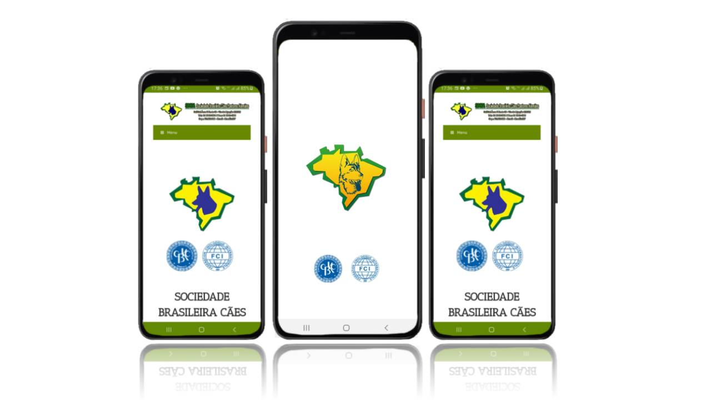

# Portfolio
*Paulo Gustavo | Android Developer*

# Tic Tac Toe

This project is the classic tic-tac-toe game of X and O, who take turns marking the spaces that align the X or O vertically, horizontally, and diagonally wins. this was deployed on Google Play.

### Technology and Tools
* **Kotlin** 

[Available on](https://play.google.com/store/apps/details?id=com.pgustavo.hashgame)

# SBCPA

This project was developed in kotlin using webview. For SBCPA "Sociedade Brasileira de Cães Pastores Alemães". In this app, you can follow and have all the resources you would typically have on the SBCPA website.

### Technology and Tools
* **Kotlin** 
* **Webview**

[Available on](https://play.google.com/store/apps/details?id=com.pgustavo.sbcpa)

# LHS Control

This is a freelancer project. The app was developed to control travel which is made by the drivers of the tourism company.  

### Technology and Tools
* **Kotlin** 
* **JetPack Compose**
* **MVVM**

