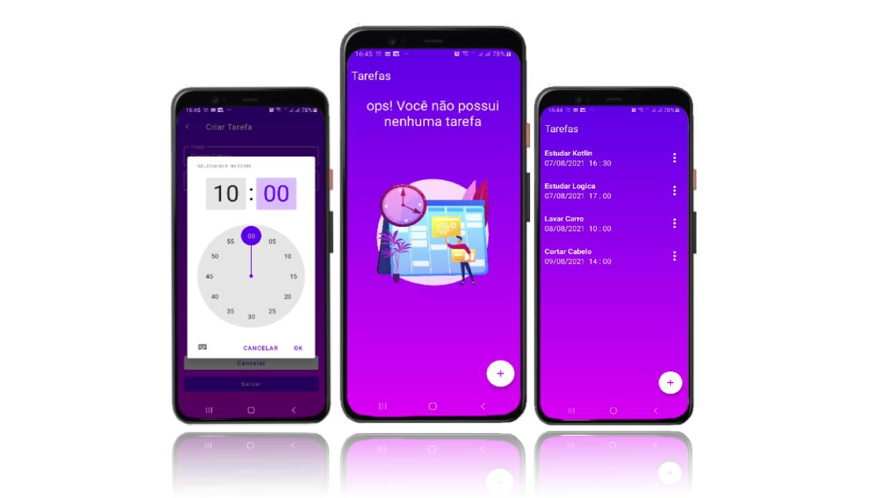

*My name is ___Paulo Gustavo___,  and I’m a ___Mobile Android Developer___ who graduated in ___Information Systems___ from Faculdade Santa Maria in 2013. Since 2021, I have been studying and doing my projects and have two apps on the Play Store.*

# Portfolio

# Tic Tac Toe

This project is the classic tic-tac-toe game of X and O, who take turns marking the spaces that align the X or O vertically, horizontally, and diagonally wins. this was deployed on Google Play.

### Technology and Tools
* **Kotlin** 

# SBCPA

This project was developed in kotlin using webview. For SBCPA "Sociedade Brasileira de Cães Pastores Alemães". In this app, you can follow and have all the resources you would typically have on the SBCPA website.

### Technology and Tools
* **Kotlin** 
* **Webview**

# LHS Control

This is a freelancer project. The app was developed to control travel which is made by the drivers of the tourism company.  

### Technology and Tools
* **Kotlin** 
* **JetPack Compose**
* **MVVM**

# MyChat App

I found an excellent tutorial on YouTube made by Chirag Kachhadiya. But was entirely in Java. Then I challenged myself to follow this tutorial. And bring everything to Kotlin. I also made some improvements. We can edit messages, delete them, and send pictures. And we can zoom in and zoom out with finger pincers and download these pictures.

### Technology and Tools
* **Kotlin** 
* **MVVM**
* **Retrofit**
* **FireBase**
* **Share Preferences**

# Star Wars Trivia App

With this app, I join two of my passions. Develop Android apps and Star Wars. This app has the objective of giving more knowledge about the Star Wars saga through a trivia game while having fun. I simulate an API behavior through Github-pages, an API of Star Wars Questions that has been consumed by this Trivia App.

### Technology and Tools
* **Kotlin** 
* **MVVM**
* **Retrofit**
* **Coroutines Flow**
* **Dagger Hilt**
* **Share Preferences**
* **Material 3**
* **Jetpack Compose**

# Marvel App

This app consumes data from a Marvel API. To show a list of Marvel characters. I also use the new features in Material Design 3, allowing an application's user interface to be themed dynamically based on the user's wallpaper. Also, you can favorite the characters.

### Technology and Tools
* **Kotlin** 
* **MVVM**
* **Retrofit**
* **Hilt**
* **Room Data Base**
* **Coroutines**

# Weather App

App shows the current weather of 5 cities from Open Weather API. Users can add cities and remove them as well and see weather details.

### Technology and Tools
* **Kotlin** 
* **MVVM**
* **Retrofit**
* **Koin**
* **Room Data Base**

# To Do App

This is a To-do app in which we can schedule a task, and when the time comes a notification is sent to warn the user to do the task.

### Technology and Tools
* **Kotlin** 
* **MVVM**
* **Room Data Base**
* **Push notification**

# Nautico news App

I developed one Native Android app for the first time in Java, which I usually do in Kotlin. I was using native components like Android Jetpack, Retrofit, and Room. For this, I used a REST API of soccer news created in git hub pages. I use a new library to apply Dynamic Color Material Design 3 to make the app's UI match the device's theme color palette.

### Technology and Tools
* **Java** 
* **MVVM**
* **Retrofit**
* **Room Data Base**

  
  
  

